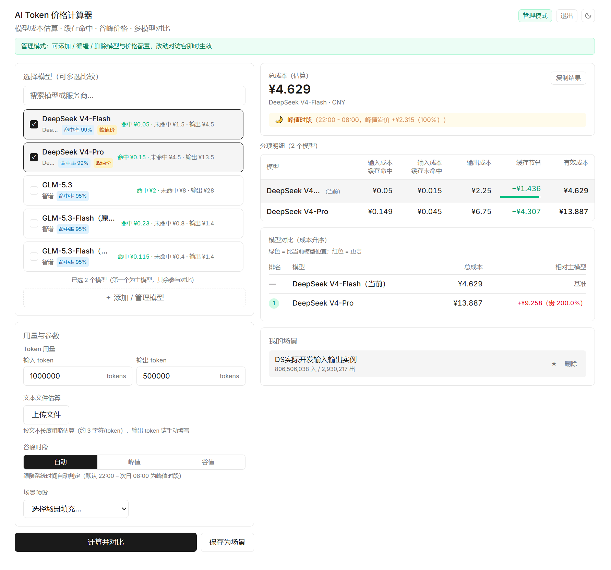

# siungo-token-cost — AI Token 价格计算器（公开工具站）

> 公开、可自部署的 AI Token 价格计算工具：按 **¥/1M tokens** 三档价格（命中输入 / 未命中输入 / 输出）估算多模型成本，支持缓存命中率、谷峰时段手动切换（自动 / 峰值 / 谷值）、日夜间模式与多模型分项成本对比表格。访客免登录直接使用。

[English](README.md)

## 界面预览



## 使用方法

1. **选择模型**：支持多选，第一个为主模型，其余自动参与对比。
2. **填写用量**：输入 / 输出 token 数量，也可上传文本文件按字数粗略估算输入量。
3. **选择谷峰时段**：自动（跟随系统时间，默认 22:00 - 次日 08:00 为峰值）/ 峰值 / 谷值，切换后立即重新计算。
4. **查看结果**：总成本、分项明细表格（命中输入 / 未命中输入 / 输出 / 缓存节省 / 有效成本）与成本排名一目了然。
5. **保存场景**：把常用模型 + 用量组合存到本机浏览器，下次一键复用。
6. **管理模式**：点击右上角 ⚙ 登录后可添加 / 编辑 / 删除模型与价格配置，改动对访客即时生效。

## 快速开始（本地开发）

### 1. 后端

```bash
cd server
ADMIN_PASSWORD='替换为强密码' go run . -addr 127.0.0.1:8089 -data ../data/token-cost.db
```

**未设置 `ADMIN_PASSWORD` 服务拒绝启动**。首次启动自动建表并填充 4 条种子模型（DeepSeek V4-Flash/Pro、Kimi K3、GLM-5.3），幂等：已有数据则跳过。

健康检查：`curl http://127.0.0.1:8089/api/health`

### 2. 前端

```bash
cd web
npm install
npm run dev
# 访问 http://localhost:5173/friends/token-cost/ （/api 自动代理到 8089）
```

> **子路径部署**：`web/vite.config.ts` 的 `base` 必须与 nginx location 一致（如 `https://www.siungo.top/friends/token-cost/`）。API 客户端从同一 base 解析 `/api`，请求始终带子路径前缀，不会被站点其他 `/api` 反代规则接管。

## 许可证

[Apache-2.0](LICENSE) © 2026 Siungo

---

*欢迎提 Issue 与 PR。*
